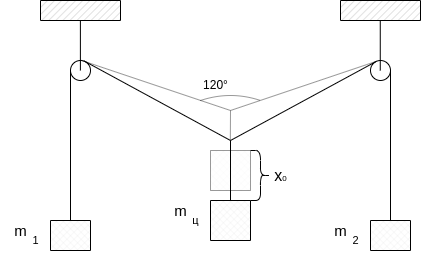

# Physics Project

### Задача
Смоделировать физический процесс, описанный в задаче ниже.

Через два блока, подвешенных на одной высоте,
переброшена длинная нерастяжимая нить,
к концам которой прикреплены два груза массой $m_1$ и $m_2$.
К середине нити прикрепляют еще один груз массой $m_c$.
Расстояние между осями блоков равно $l$.
Центральный груз оттягивают на расстояние $x_0$ вниз от положения равновесия.
Трением и сопротивлением воздуха можно пренебречь.

### Метод решения задачи
Симуляция физики с помощью библиотеки [pdrust](https://github.com/FEgor04/pdrust) на основе движка
[Bevy Engine](https://github.com/bevyengine/bevy).
Получившийся проект собран для `WASM` и развернут на сервере кафедры.
Итоговая работа доступна по [ссылке](https://se.ifmo.ru/~s367581).

### Участники проекта
- [Егор Федоров, P3215](https://github.com/FEgor04)
- [Владимир Бессонов, P3212](https://github.com/vovibssnff)
- [Балин Артем, P3212](https://github.com/ta4ilka69)
- [Карабанов Андрей, P3215](https://github.com/Forafox)
- [Кобелев Роман, P3212](https://github.com/Romariok)
